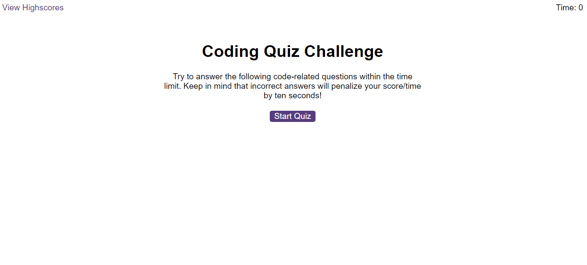
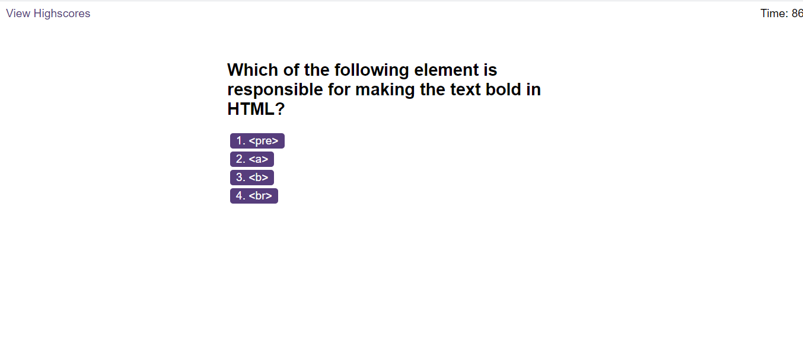
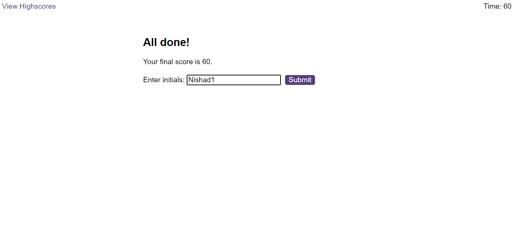
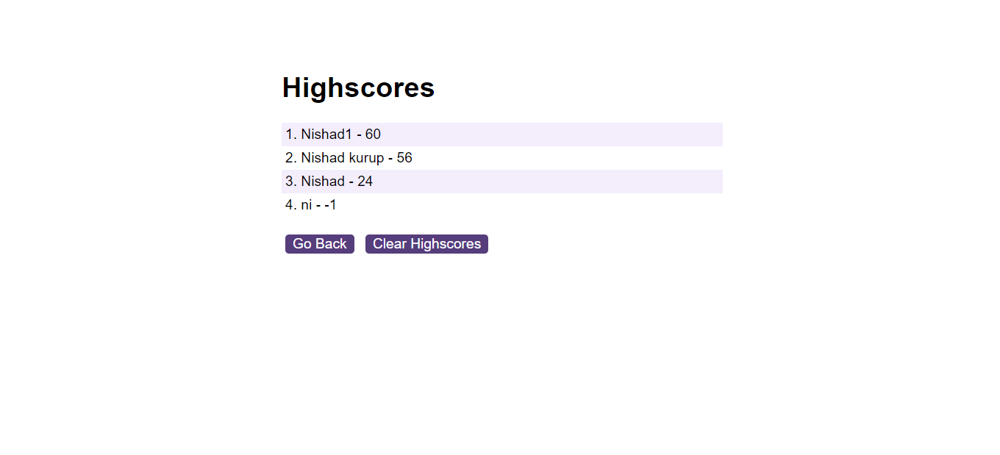

# CODE-QUIZ

 ### Table of Contents
 * [Descritption](#description)
 * [Installation](#installation)
 * [Technologies-Used](#technologies-used)
 * [Usage](#usage)
 * [License](#license)
 * [Contribution](#contribution)
 * [Tests](#tests)
 * [Questions](#questions)
___
  ## Description
  The purpose of this project was to design a functional multiple choice quiz about coding. As the user answers questions, the page transitions to the next question. When the quiz is over or when the timer is at zero, the game is over and the user can input his or her initials and save a high score. These scores are in local storage, so that the user can view previous scores again even after the page has been refreshed.
  

## Technologies-Used
* HTML
* CSS
* JavaScript
----

 ## Installation
 No installation steps are required to run this App.

[Back to Table](#table-of-contents) 

 ## Usage
1. When you load the page you have a highscore button at top left of the page and a timer at the top right of the page.
In the  middle it have a Start Quiz button .

2. The quiz is multiple choice and once you select your answer: "Correct!" or "Wrong!" will flash quickly below the answer buttons. After you answer the first question it will move on to the second question and so on until you either answer all the questions or the timer runs out.If you answer incorrectly a penelty of 15 seconds will be taken off the timer. When you answer correctly no extra time is subtracted and you gain one point.

3. At the end of the quiz a form will appear that ask to enter your name, After you click submit it] will take you back to the start of the quiz.

 At the top left of the home page is the highscore button. Clicking that will take you to the highscore list. There you will find the list of scores with the initials of the person who recieved that score. This is also tied to local storage so if you take the quiz again and get a different score your first score will still be in the higscore list.

 

[Back to Table](#table-of-contents) 

## License 
Currently no license used .

## Contribution
  Contributors: This project was a solo project .

  [Back to Top](#table-of-contents)

  ## Tests
  There are currently no tests written for this project.

  [Back to Top](#table-of-contents)
    

  ## Questions
  If you have any questions about this application my GitHub username is
  [nishadkurup](github.com/nishadkurup) and you can view my GitHub profile at https://github.com/nishadkurup. 

  For any additional questions, feel free to reach out to me at Email:nishadkurup@gmail.com

